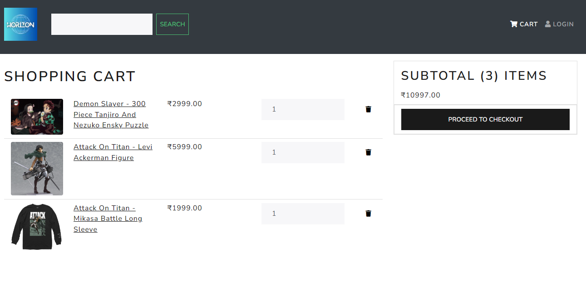

<h1 align=center>Horizon - Anime Merchandise and Cosplay Shop</h1>
<h2 align=center>E-Commerce Website for Cosplay and Merchandise</h2>


### How to Run 🏃‍♀️

```shell
1 Clone This Repo
2 cd backend
3 python -m venv env
4 .\env\Scripts\activate
5 pip install -r requirements.txt 
6 python manage.py runserver

```

### 📷 Project Screenshots





### 🚀 Project Features

A completely customized eCommerce / shopping cart application using Django, REACT and REDUX with the following functionality:

- Full-featured shopping cart
- Product reviews and Ratings
- Top product carousel
- Product pagination
- Product search feature
- User profile with orders
- Admin Product Management
- Admin user management
- Admin Order details page
- Mark the order as a delivered option
- Checkout process (shipping, payment method, etc)
- PayPal / credit card integration


This project is used as a source for academic projects through public licence. Necessory changes are made according to the requirements. The source code and images belong to the respective owner. 
